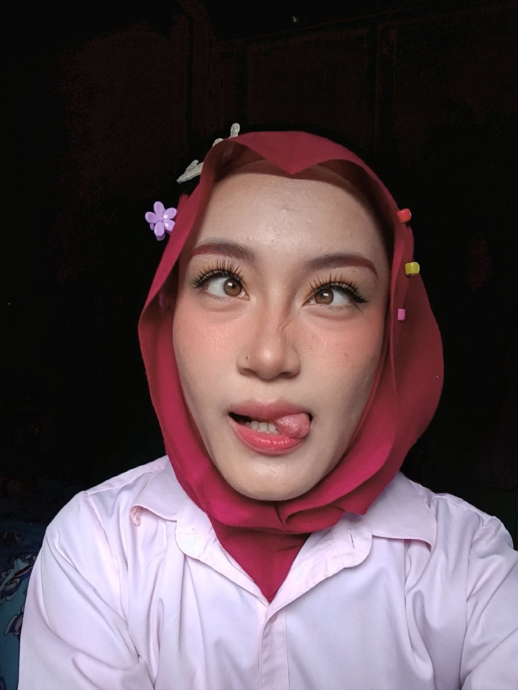
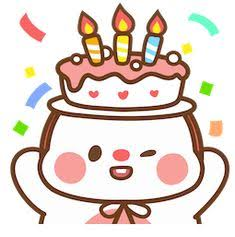
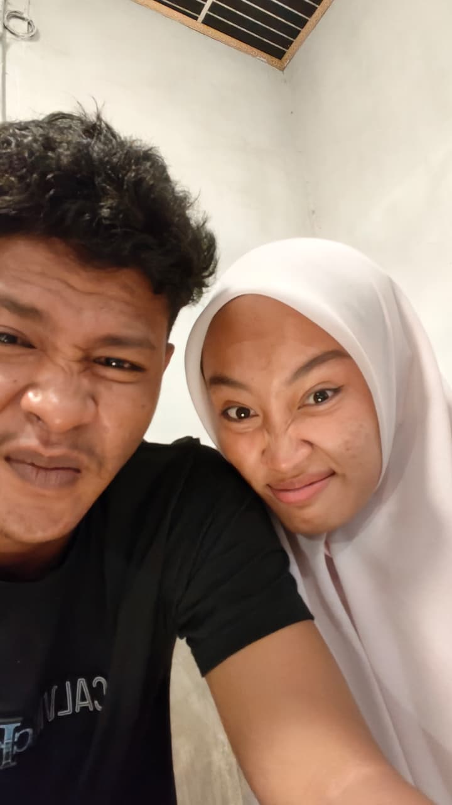
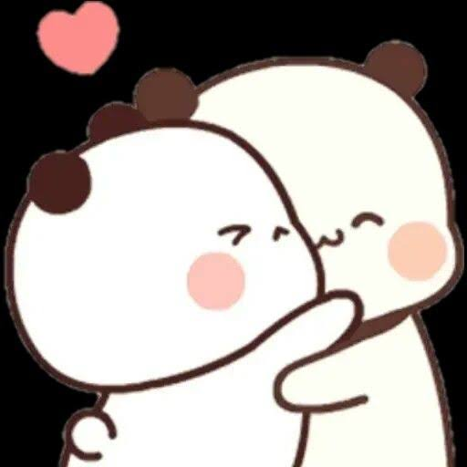

<html lang="id">
<head>
  <meta charset="UTF-8">
  <meta name="viewport" content="width=device-width, initial-scale=1.0">
  <title>Happy Birthday! ✨</title>
  
</head>
<body>

  <!-- Background Ambient Glow -->
  

  

  <!-- Container Cahaya Love Berterbangan -->
  

  

    <!-- KARTU 1 -->
    

      Karya Kecil dari Adik Kecil💃😘
      

        
      

      <h2>Klik Sampai Abis Yaw..</h2>
      <button class="btn" onclick="nextCard(1, 2, event)">Klik Disini ➡️</button>
    

    <!-- KARTU 2 -->
    

      A Special Wish
      

        
      

      <h2>Happy Birthday Sayang!!🥳🎉</h2>
      
Selamat ulang tahun!! Ada beberapa ucapan singkat dari adik untuk sayangku...

      <button class="btn" onclick="nextCard(2, 3, event)">Klik Disini Lagi ➡️</button>
    

    <!-- KARTU 3 -->
    

      in this relationship
      kita gapunya foto bagus🙂‍↔️
      

        
      

      <h2>Tapi Terima Kasih ✨</h2>
      
Terima kasih sudah selalu membawa kenyamanan, keceriaan, kelucuan, apalagi? kepercayaan di setiap momen ldr kita ini

      <button class="btn" onclick="nextCard(3, 4, event)">1 Lagi.. ➡️</button>
    

    <!-- KARTU 4 -->
    

      Secuil Doa
      

        
      

      <h2>Harapan Terbaik 🎂</h2>
      
Semoga di usia yang sekarang, segala keinginan dan harapan berjalan lancar, sehat selalu, bahagia selalu, sayang samaku selalu... doa-doa baik untuk sayangku..

      <button class="btn" onclick="nextCard(4, 5, event)">Terakhir ➡️</button>
    

    <!-- KARTU 5 -->
    

      Pesan Terakhir
      

        
      

      <h2>Dahla Capek</h2>
      
<i>Alay kalau banyak-banyak</i> <i>Lebihnya doa sendiri yaww</i>  Sekali lagi, Happy Birthday! 🥳✨

      <button class="btn" onclick="nextCard(5, 6, event)">Dah Habissss ➡️</button>
    

    <!-- KARTU 6 -->
    

      Sekian Terima Gaji🙏🤙
      

        
      

      <h2>I Love You! 💖</h2>
      <button class="btn" onclick="restartCards(event)">Ulang dari Awal 🔄</button>
    

  

  
</body>
</html>
